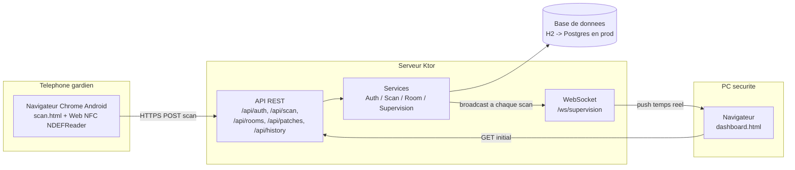

# Architecture technique — Rondes NFC

## Schema d'ensemble



Un seul serveur pour l'API REST et le WebSocket : pas de composant supplementaire a
deployer/monitorer pour un POC / un site unique. Le decoupage en services (`AuthService`,
`ScanService`, `RoomService`, `SupervisionHub`) permet d'extraire l'un d'eux en microservice
plus tard sans reecrire la logique metier si la charge l'impose.

## Justification des choix technos

| Choix | Pourquoi | Alternative ecartee |
|---|---|---|
| **Kotlin + Ktor** | Coroutines natives -> WebSocket et acces DB asynchrones sans code bloquant ; ecosysteme JVM mature (observabilite, bibliotheques de securite comme jBCrypt) ; coherence si le client souhaite un jour une app Android native (meme langage cote back et mobile). | Node/Express : plus rapide a demarrer mais typage plus faible pour un systeme ou l'integrite des donnees (preuve de passage) est justement l'enjeu central. |
| **Web NFC (PWA) plutot qu'appli Android native** | Zero installation, zero mise a jour a distribuer sur les telephones des gardiens (souvent du materiel partage/mutualise entre vacations) ; une simple URL suffit ; deploiement instantane d'une correction de bug sur tous les postes. | App native Android : lecture NFC plus riche (ecriture NDEF, NFC en arriere-plan) mais cycle de publication/mise a jour plus lourd, hors delai d'une semaine, et ne resout pas le probleme iOS (Web NFC n'est de toute facon supporte que par Chrome/Android : le choix natif n'aurait ete justifie que par un besoin iOS, absent ici). |
| **Exposed + H2 (fichier) pour le POC** | Aucune infra a installer pour faire tourner la demo (pas de serveur DB separe) ; migration vers Postgres = changer une URL JDBC, le DSL Exposed ne change pas. | SQLite : moins bien outille en Kotlin/JVM pour la concurrence en ecriture (WAL moins mature que Postgres). |
| **WebSocket pour la supervision** | Mise a jour "sans action manuelle" du besoin client, sans le cout reseau d'un polling agressif ; latence quasi nulle entre un scan et son affichage au PC securite (effet demo fort). | Polling REST toutes les X secondes : plus simple mais latence perceptible et charge serveur inutile a l'echelle de 50 musees. |
| **Jeton opaque + bcrypt plutot que JWT** | Revocation immediate possible (deconnexion, compte desactive) car le jeton est verifie contre une table `sessions` a chaque requete — un JWT signe resterait valide jusqu'a expiration meme apres desactivation d'un compte, ce qui est inacceptable pour de la securite physique. | JWT stateless : plus scalable horizontalement mais moins sur pour ce cas d'usage precis. |

## Modele de donnees

```
Rooms        (id, name, building, floor, orange_threshold_minutes, red_threshold_minutes)
Guards       (id, badge[unique], full_name, pin_hash, role, active, failed_attempts, locked_until)
Patches      (id, tag_uid[unique], room_id -> Rooms, active, damaged, created_at)
Scans        (id, patch_id -> Patches, room_id -> Rooms, guard_id -> Guards,
              scanned_at, received_at, offline_sync)
Sessions     (id, token[unique], guard_id -> Guards, created_at, expires_at)
```

Points de conception :
- `Patches.room_id` nullable : un patch existe avant d'etre associe (flux d'enrollment).
- `Scans` denormalise `room_id` (deja present via `patch_id`) pour garder l'historique
  coherent meme si un patch est reassocie plus tard a une autre salle.
- `scanned_at` (revendique, potentiellement differe/hors-ligne) est distinct de
  `received_at` (reception serveur) — necessaire pour detecter des ecarts suspects et
  pour la tracabilite des synchronisations differees.
- Seuils d'alerte (`orange_threshold_minutes`, `red_threshold_minutes`) portes par la
  salle, pas globaux : une reserve peu visitee et une salle d'entree n'ont pas la meme
  criticite (repond au point souleve par le client : "est-ce le meme delai pour toutes
  les salles ?" — non).

## Deploiement et scalabilite : 1 musee -> 50 musees

**Aujourd'hui (POC / 1 site)** : un process Ktor, H2 fichier local, deploiement manuel.

**Etape 1 (site pilote reel)** : Postgres manage (une seule ligne a changer, meme DSL
Exposed), TLS via certificat interne ou reverse proxy (Caddy/Nginx), sauvegarde
automatisee de la base.

**Etape 2 (multi-site, 5-10 musees)** : un seul backend central mutualise (chaque musee
= un jeu de `Rooms`/`Patches` isole par un `site_id`), authentification par musee, un
dashboard filtrable par site pour une supervision multi-site depuis un PC central si le
client le souhaite (chaine de securite groupee).

**Etape 3 (50 musees)** : passage a une architecture horizontale — plusieurs instances
Ktor sans etat derriere un load balancer (les sessions sont deja en base, pas en memoire
locale, donc l'horizontal scaling ne casse rien), le WebSocket de supervision necessitant
alors un relais des evenements entre instances (Redis pub/sub ou equivalent) pour que le
scan traite par l'instance A soit bien pousse au dashboard connecte a l'instance B.
Prevoir un CDN/edge pour les pages statiques (`scan.html`, `dashboard.html`) qui n'ont pas
besoin de repasser par le serveur applicatif a chaque chargement.
